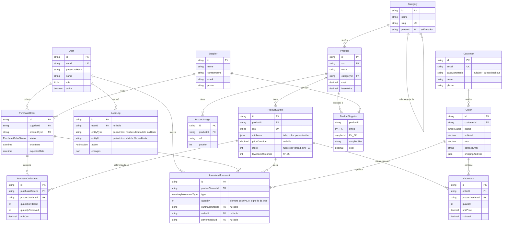

# Diagrama Entidad-Relación

Generado a partir de [`schema.prisma`](./schema.prisma). Ver `../../inventario-app/requerimientos.md` para el detalle de requerimientos (RF-XX) que motivan cada entidad.

## Decisiones de diseño

- **`ProductVariant.stock` es el campo fuente de verdad**, no una suma calculada de `InventoryMovement` en cada lectura (por performance en listados/catálogo, RNF-06). Se actualiza siempre dentro de la misma transacción de BD que inserta la fila de `InventoryMovement` correspondiente (RNF-01), nunca de forma aislada — así el saldo y el historial nunca divergen.
- **`InventoryMovement` es append-only**: nunca se edita ni se borra una fila existente; para corregir un movimiento se inserta un nuevo movimiento de ajuste (`AJUSTE_ENTRADA`/`AJUSTE_SALIDA`). Esto es lo que hace confiable el historial de RF-04 y la auditoría de RF-12.
- **`Customer.passwordHash` es nullable** para soportar guest checkout (RF-17/RF-19): un pedido siempre requiere un `Customer`, pero éste puede crearse solo con email/nombre/teléfono en el momento del checkout, sin cuenta. Si el cliente decide registrarse después, se completa `passwordHash` sobre el mismo registro (buscado por email).
- **`AuditLog` usa `entityType` + `entityId` genéricos** en vez de una FK por cada tipo de entidad auditable, para no tener que tocar el schema cada vez que se decide auditar una tabla nueva.
- **`Category` es auto-referencial** (`parentId`) para soportar subcategorías (RF-06) con un solo nivel de anidamiento adicional en v1 (no se modeló un árbol arbitrariamente profundo porque el documento de requerimientos no lo pide).
- **Decimal, no Float**, para todos los montos de dinero (`cost`, `basePrice`, `unitCost`, `unitPrice`, `subtotal`, `total`) — evita errores de redondeo en cálculos financieros.
- **RF-18 resuelto: decremento inmediato de stock**, no reserva con expiración. Al confirmar un pedido, `ProductVariant.stock` se decrementa dentro de la misma transacción que crea el `Order`, sus `OrderItem` y el `InventoryMovement` (`VENTA_SALIDA`) — sin estado intermedio de "reservado" ni tabla de reservas con TTL. Si dos clientes compiten por el mismo `ProductVariant`, la transacción debe leer el `stock` con lock (`SELECT ... FOR UPDATE` o nivel de aislamiento `Serializable`) y rechazar la venta si no alcanza, para cumplir RNF-01 y evitar sobreventa.

## Pendiente de definir (fuera de este modelo)

- Reglas exactas de permisos por rol y por endpoint (Próximos Pasos #4 en `requerimientos.md`) — este schema define **quién puede existir** (roles), no **qué puede hacer cada rol**.
